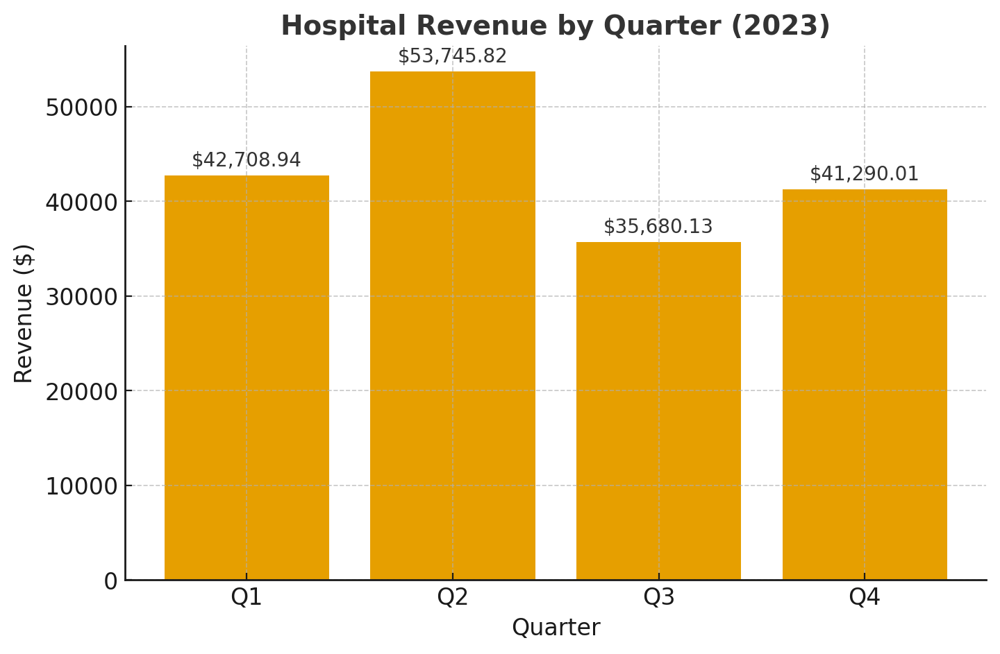
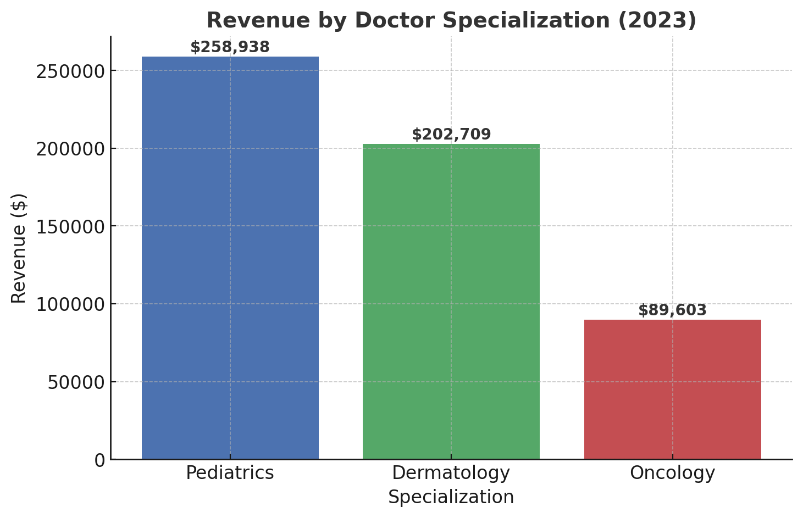
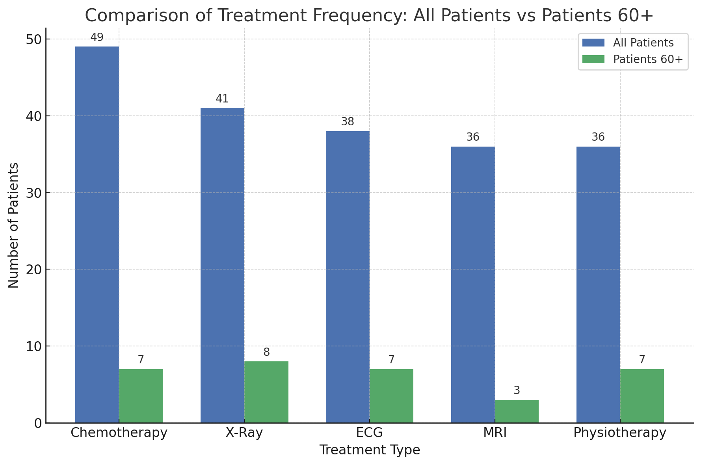

# Introduction
📊 Dive into hospital management and healthcare services 🏥! This project explores hospital revenue 💰, treatment costs 💵, top-earning specializations 🔥, the most frequent elderly treatment 👴👵, and the busiest hospital branch 🏥. 

🔍 SQL queries? Check them out here: [project_sql folder](/project_sql/)


# Background
To better understand hospital operations, this project aims to analyze hospital management by identifying the highest quarterly revenue, treatment costs, top-earning specializations, the most common senior treatment, and the branch that handles it.

Data hails from [Hospital Management dataset](https://www.kaggle.com/datasets/kanakbaghel/hospital-management-dataset). It's packed with insights on patients, doctors, appointments, treatment, billing.

The Entity-Relationship Diagram (ERD) I created:
[ER Diagram](ER_Hospital_Project.jpg)

### *The questions I wanted to answer through my SQL queries were*:
1. What is the total hospital revenue in 2023, and how does it break down by quarter?

2. What is the average cost for each treatment type (e.g., MRI, Chemotherapy)?

3. Which doctor specialization generates the highest revenue?

4. Which treatment is most common among patients over 60, and how does it compare to all age groups?

5. Which hospital branch will receive the patients over 60 of the most frequent treatment type?


# Tools I used
For my deep dive into the hospital management, I harnessed the power of several key tools:

- **SQL**: The backbone of my analysis, allowing me to query the database and unearth critical insights.
PostgreSQL: The database management system used for handling the hospital dataset. 
- **Visual Studio Code**: My go-to for database management and executing SQL queries.
- **Git & GitHub**: Essential for version control and sharing my SQL scripts and analysis, ensuring collaboration and project tracking.

# The Analysis
Each query for this project aimed at investigating specific aspects of the hospital management. Here’s how I approached each question:


### 1. Quarter Revenue of the Hospital
To identify the hospital's quarterly revenue in 2023, I grouped bill_date by quarter and added up the amount of each bill, focusing on only bills with a Paid status. This query highlights the hospital’s revenue trends across different quarters. 

```sql
SELECT 
    EXTRACT(QUARTER FROM bill_date) AS quarter,
    SUM(CASE WHEN payment_status = 'Paid' THEN amount ELSE 0 END) AS paid_revenue
FROM 
    billing
GROUP BY 
    EXTRACT(QUARTER FROM bill_date)
ORDER BY 
    quarter;

```
Here's the breakdown of the hospital revenue in 2023:
- **Quarter 2** (April- June) generated the highest revenue: $53,745.82
This accounts for about one-third of the total yearly revenue ($173,424.90).

- Quarter 3 (July–September) generated the lowest revenue: $35,680.13 that is 16% lower than Quarter 1 ($42,708.94). 



*Bar graph visualizing the revenue for each quarter for the hospital; ChatGPT generated this graph from my SQL query results*

### 2. Average Cost of each Treatment Type
Exploring the average cost associated with different treatment type revealed potential expenses for patients and provided financial records for hospital to optimize pricing and identify high-cost procedures.

```sql
SELECT 
    treatment_type,
    AVG(cost) AS cost_per_treatment_type
FROM treatments
GROUP BY treatment_type
ORDER BY cost_per_treatment_type DESC;

```
Here's the breakdown of the average cost of each treatment type in 2023:
- **MRI** is the most expensive treatment, averaging $3,224.95 per procedure.

- ECG is the least costly, averaging $2,532.22 per procedure.

Other treatments, including Physiotherapy ($2,761.61), X-Ray ($2,698.87), and Chemotherapy ($2,629.71), fall in between these two extremes.


#### Average Cost per Treatment Type (2023)

| Treatment Type | Average Cost ($) |
|----------------|------------------|
| MRI            | 3224.95          |
| Physiotherapy  | 2761.61          |
| X-Ray          | 2698.87          |
| Chemotherapy   | 2629.71          |
| ECG            | 2532.22          |


### 3. Revenue by Doctor Specialization (2023)
This query shows the revenue per doctor specialization, helped the hospital make strategic hiring decisions.

```sql
SELECT 
    specialization,
    SUM(cost) AS revenue_per_specialization
FROM 
    billing
INNER JOIN treatments
    ON billing.treatment_id = treatments.treatment_id
INNER JOIN appointments
    ON treatments.appointment_id = appointments.appointment_id
INNER JOIN doctors
    ON appointments.doctor_id = doctors.doctor_id
WHERE 
    cost IS NOT NULL
GROUP BY 
    specialization
ORDER BY revenue_per_specialization DESC;
```

Here's the breakdown of the revenue of each doctor's specialization:
- **Pediatrics** specialists generate the highest revenue ($258,937.83), which is over 3 times as high as the revenue from Oncology specialists ($89,602.73).  
- **Dermatology** ranks as the second-highest contributor with $202,709.29. This demonstrates that hospital can hire more doctors who specialize in Pediatrics since they will contribute the most to overall revenue.


*Bar graph visualizing the revenue for each doctor specialization; ChatGPT generated this graph from my SQL query results*


### 4. Common treatment types for all patients vs elderly patients

**All patients**:

This query finds out the count of each treatment type, offering a strategic focus for specific treatment type.
``` sql
SELECT 
    treatment_type,
    COUNT(treatment_type) AS frequent_treatment
FROM 
    treatments
GROUP BY
    treatment_type
ORDER BY 
    frequent_treatment DESC

```

Here's the breakdown of the most frequent treatment types:
- **Chemotherapy** is the most common treatment, with 49 patients receiving it.
- Physiotherapy and MRI are the least common, each with 36 patients.


#### 📋 Treatment Frequency (All Patients)
| Treatment Type | Frequency |
|----------------|-----------|
| Chemotherapy   | 49        |
| X-Ray          | 41        |
| ECG            | 38        |
| MRI            | 36        |
| Physiotherapy  | 36        |
|
|


**Patients over 60**:

To understand which treatments are most frequently received by elderly patients, I first filtered the patients over 60 and then joined their records with appointments and treatments data. This provides insights into the most common treatment needs for senior patients, helping hospitals plan resources, allocate staff, and optimize service for this age group.  

```sql
WITH elderly_patients AS (
SELECT 
    patient_id,
    date_of_birth 
FROM 
    patients
WHERE 
    EXTRACT(YEAR FROM AGE(CURRENT_DATE, date_of_birth)) >= 60
)

SELECT 
    treatment_type,
    COUNT(treatment_type) AS elderly_frequent_treatment
FROM 
    treatments
INNER JOIN
    appointments ON treatments.appointment_id = appointments.appointment_id 
INNER JOIN
    elderly_patients ON appointments.patient_id = elderly_patients.patient_id
GROUP BY
    treatment_type
ORDER BY 
    elderly_frequent_treatment DESC

```

Here's the breakdown of the most common treatment types for patients over 60:
- **X-Ray** is the most common treatment, with 8 elderly patients receiving it. This suggests that X-Ray plays a critical role in elderly care.

- MRI is the least common, with only 3 elderly patients.


#### 📋 Treatment Frequency (Patients 60+)
| Treatment Type | Frequency |
|----------------|-----------|
| X-Ray          | 8         |
| ECG            | 7         |
| Physiotherapy  | 7         |
| Chemotherapy   | 7         |
| MRI            | 3         |



*Comparison plot visualizing the difference of the treatment frequency between all patients and senior patients; ChatGPT generated this graph from my SQL query results* 


From the comparison plot, **Chemotherapy** is very common among both all age groups and senior patients. Although it is not the most frequent treatment for seniors, its patient count is only one less than X-Ray, which ranks as the top treatment for senior patients


### 5. Most Frequent Treatment by Hospital Branch (Patients 60+)

Combining insights from appointments and doctors data, this query aimed to pinpoint the hospital branch that receive the most X-Ray patients. X-Ray is the most frequent treatment type for senior patients that we obtained from previous analysis. 

```sql
SELECT 
    hospital_branch,
    COUNT(hospital_branch) AS count_hospital_branch
FROM 
    treatments

INNER JOIN 
    appointments ON treatments.appointment_id = appointments.appointment_id
INNER JOIN 
    doctors ON appointments.doctor_id = doctors.doctor_id
WHERE 
    treatment_type = 'X-Ray'
GROUP BY
    hospital_branch
ORDER BY
    count_hospital_branch DESC
LIMIT 1
```

Here's the breakdown of the hospital branch that receives the most common treatment type:
- **Central Hospital** receives the highest number of common treatments for patients over 60, particularly X-Rays (21 cases). The number of X-Ray patients there is more than twice that of Westside Clinic or Eastside Clinic (10 cases each) . 

#### X-Ray Treatments for Senior Patients by Hospital Branch  

| Hospital Branch    | Number of Patients |
|--------------------|---------------------|
| Central Hospital   | 21                  |
| Westside Clinic    | 10                  |
| Eastside Clinic    | 10                  |

# What I learned
Throughout this adventure, I've turbocharged my SQL toolkit with some serious firepower:

- 🧩 Complex Query Crafting: Mastered the art of advanced SQL, merging tables like a pro and wielding WITH clauses for ninja-level temp table maneuvers.
- 📊 Data Aggregation: Got cozy with GROUP BY and turned aggregate functions like COUNT() and AVG() into my data-summarizing sidekicks.
- 💡 Analytical Wizardry: Leveled up my real-world puzzle-solving skills, turning questions into actionable, insightful SQL queries.


# Conclusions
## Insights
From the analysis, several general insights emerged:
Quarterly Hospital Revenue:

1. **The highest revenue** was recorded in Quarter 2 (April–June), highlighting strong seasonal variation, with peak revenue in Quarter 2 and a noticeable decline in Quarter 3.

2. **Average Cost of Each Treatment Type**: 
MRI is the most expensive treatment on average ($3,224.95), helped hospital management evaluate pricing strategies and better inform patients about potential expenses.

3. **Revenue by Doctor Specialization**:
Doctor specialization, such as Pediatrics, are associated with the highest revenue, suggesting the hospital could benefit from hiring or allocating more resources toward Pediatrics specialists, as they contribute the most to overall revenue.

4.  **Most Common Treatments**:
- For *all patients*, Chemotherapy plays the most significant role in hospital operations (49 cases).

- For *patients over 60*, X-Ray was the most common treatment (8 cases), indicating treatment needs shift with age. 


5. **Hospital Branch Treating Elderly Patients**:
Central Hospital received the highest number of elderly patients for X-Ray treatments (21 cases), compared to the two clinics, thus making it the preferred location for elderly treatment needs.


## Closing Thoughts
This project enhanced my SQL skills and provided valuable insights into hospital management. The findings serve as a guide for seasonal planning, prioritizing high-demand treatments, strategic staff hiring, and resource allocation. Quarter 2 generates the highest revenue, X-Ray is the most frequent treatment for elderly patients, and Pediatrics specialists contribute the most to the hospital’s revenue. Overall, this exploration highlights the importance of hospital management to emerging trends in the field of healthcare services.


